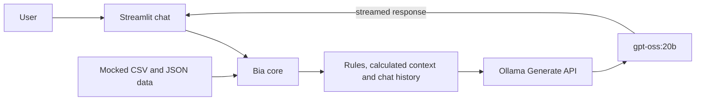

# Bia do Futuro — Generative AI Financial Educator

[](https://www.python.org/)
[](https://streamlit.io/)
[](https://ollama.com/library/gpt-oss%3A20b)

> A local generative AI assistant that explains personal finance concepts using a fictional customer profile and mocked financial data.

[Português](#português) · [Technical documentation](./docs/) · [DIO challenge](https://github.com/digitalinnovationone/dio-lab-bia-do-futuro)

## Overview

Bia was developed for the **BIA do Futuro** learning challenge from DIO in partnership with Bradesco. It combines a Streamlit chat interface, a local `gpt-oss:20b` model served by Ollama, and a CSV/JSON knowledge base.

The assistant explains financial concepts and contextualizes fictional spending data. It does not recommend investments, access bank accounts, or use live market data.

This is an independent educational project. It is not an official Bradesco or DIO product.

## Engineering highlights

- Local LLM integration through the Ollama Generate API
- Streamed responses for lower perceived latency
- Recent conversation context for follow-up questions
- Four CSV/JSON knowledge sources loaded dynamically
- Spending totals calculated in Python before reaching the model
- Low-temperature generation and a restricted 4K context window
- Guardrails against recommendations, invented values, and credential requests
- Automated tests that do not require downloading the model
- Eight reproducible evaluation scenarios for human review

## Architecture



## Requirements

- Python 3.10+
- [Ollama](https://ollama.com/)
- `gpt-oss:20b` model

The Ollama package for `gpt-oss:20b` is approximately **14 GB**. Its official model page states that it can run on systems with as little as **16 GB of memory**. For a more comfortable local CPU-based experience while the operating system and Streamlit are also running, **32 GB is the project recommendation**.

The application limits the model context to 4,096 tokens to reduce memory use and improve response time.

## Run locally

```powershell
python -m venv .venv
.venv\Scripts\activate
python -m pip install -r requirements.txt

ollama pull gpt-oss:20b
ollama serve
streamlit run src/app.py
```

Open the URL shown by Streamlit. The first response may be slower while Ollama loads the model into memory; later responses should start faster while the model remains loaded.

To use another model already installed in Ollama:

```powershell
$env:BIA_OLLAMA_MODEL="another-model"
streamlit run src/app.py
```

## Suggested questions

- What is CDI?
- Where am I spending the most?
- How much did I spend on food?
- How is the emergency fund progressing?
- Explain Tesouro Selic.
- Which product should I invest in?

The final question validates an important safety rule: Bia must explain relevant criteria without selecting an investment.

## Tests and evaluation

Run the automated tests without Ollama:

```powershell
python -m unittest discover -s tests -v
```

After installing the model, execute all documented scenarios:

```powershell
python evaluation/run_evaluation.py
```

The evaluator saves `evaluation/latest-results.json` locally for human scoring. Generated results are ignored by Git so unreviewed outputs are not presented as evidence.

## Project structure

```text
data/                         Mocked profile, transactions, products and history
docs/                         Agent design, knowledge, prompts, metrics and pitch
evaluation/scenarios.json     Reproducible challenge scenarios
evaluation/run_evaluation.py  Ollama evaluation runner
src/app.py                    Streamlit application
src/bia_core.py               Calculations, prompt and Ollama integration
tests/                        Automated unit tests
requirements.txt              Python dependencies
```

---

## Português

A Bia é uma educadora financeira com IA generativa local. O projeto foi desenvolvido para o desafio **BIA do Futuro**, da DIO em parceria com o Bradesco.

### O que a aplicação faz

- Conversa com o usuário por uma interface Streamlit.
- Executa o `gpt-oss:20b` localmente com Ollama.
- Usa dados fictícios como contexto educacional.
- Calcula entradas, saídas e categorias em Python.
- Exibe a resposta do modelo progressivamente.
- Mantém o contexto recente da conversa.
- Explica produtos e conceitos sem recomendar onde investir.

### Limites

- Não acessa contas ou dados bancários reais.
- Não consulta taxas ou cotações atuais.
- Não revela credenciais ou dados de terceiros.
- Não indica nem conecta o usuário a assessores.
- Não substitui orientação de um profissional certificado.

### Entregas do desafio

| Etapa | Entrega |
|---|---|
| 1 | [Caso de uso, persona, arquitetura e segurança](./docs/01-documentacao-agente.md) |
| 2 | [Estratégia da base de conhecimento](./docs/02-base-conhecimento.md) |
| 3 | [System prompt, exemplos e casos-limite](./docs/03-prompts.md) |
| 4 | [Aplicação funcional com LLM](./src/app.py) |
| 5 | [Testes, métricas e cenários de avaliação](./docs/04-metricas.md) |
| 6 | [Roteiro de pitch de três minutos](./docs/05-pitch.md) |

### Decisões técnicas

Os cálculos são feitos antes da chamada ao modelo, reduzindo erros numéricos. O prompt recebe somente um resumo dos dados e as seis mensagens mais recentes. A API do Ollama trabalha com streaming, temperatura 0,2 e contexto de 4.096 tokens para equilibrar coerência, memória e tempo de resposta.
