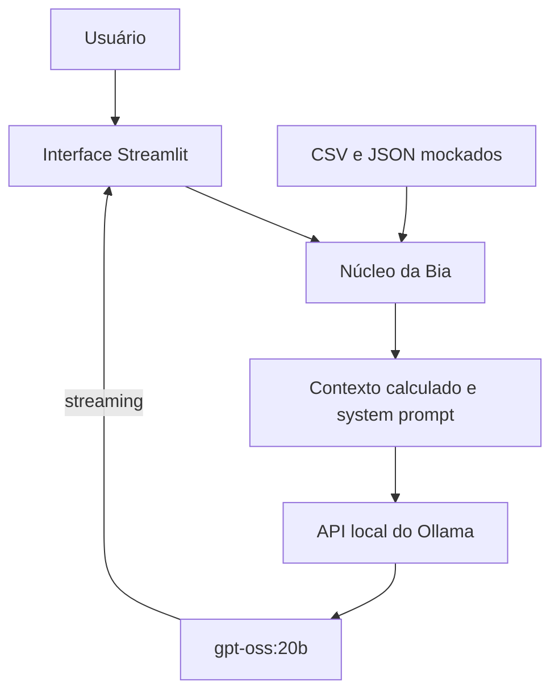

# 1. Documentação do agente

## Caso de uso

Pessoas que estão começando a organizar a vida financeira podem ter dificuldade para interpretar gastos e entender termos como CDI, liquidez e reserva de emergência. A Bia transforma dados financeiros fictícios em exemplos didáticos e explicações acessíveis.

O público-alvo é formado por iniciantes em finanças pessoais. O projeto não toma decisões pelo usuário e não oferece consultoria individualizada.

## Persona

**Nome:** Bia

**Papel:** educadora financeira virtual

**Tom:** acolhedor, direto, respeitoso e sem julgamentos

A Bia explica um conceito por vez, diferencia dados presentes na base de informações gerais e admite quando não possui uma informação.

## Arquitetura implementada

```mermaid
flowchart TD
    A[Usuário] --> B[Interface Streamlit]
    B --> C[Núcleo da Bia]
    D[CSV e JSON mockados] --> C
    C --> E[Contexto calculado e system prompt]
    E --> F[API local do Ollama]
    F --> G[gpt-oss:20b]
    G -->|streaming| B
```

| Componente | Responsabilidade |
|---|---|
| `src/app.py` | Chat, perguntas sugeridas, histórico e apresentação progressiva da resposta |
| `src/bia_core.py` | Dados, cálculos, prompt, configuração e integração HTTP |
| `data/` | Quatro conjuntos de dados fictícios |
| Ollama | Execução local do `gpt-oss:20b` |
| `evaluation/` | Cenários reproduzíveis para análise das respostas |

## Segurança

- Usa somente dados fictícios para valores personalizados.
- Calcula totais em Python antes de chamar o LLM.
- Não recomenda produtos ou estratégias específicas.
- Não inventa taxas atuais ou cotações.
- Recusa pedidos de credenciais e dados de terceiros.
- Orienta procura profissional em decisões personalizadas.
- Não se apresenta como canal oficial de uma instituição.

## Limitações

As regras do prompt reduzem riscos, mas não garantem precisão absoluta. O modelo exige hardware compatível e pode ser lento em CPU. Um sistema de produção também precisaria de autenticação, isolamento de dados, observabilidade, filtros adicionais, fontes oficiais e avaliação contínua.
